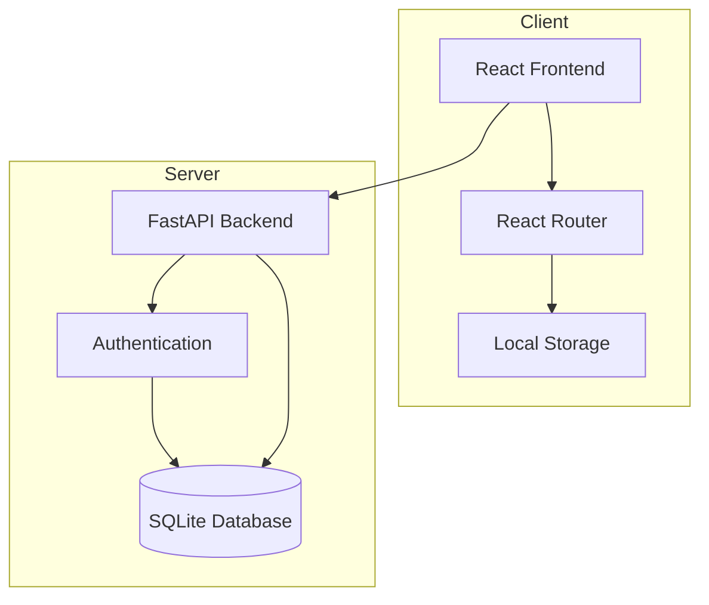
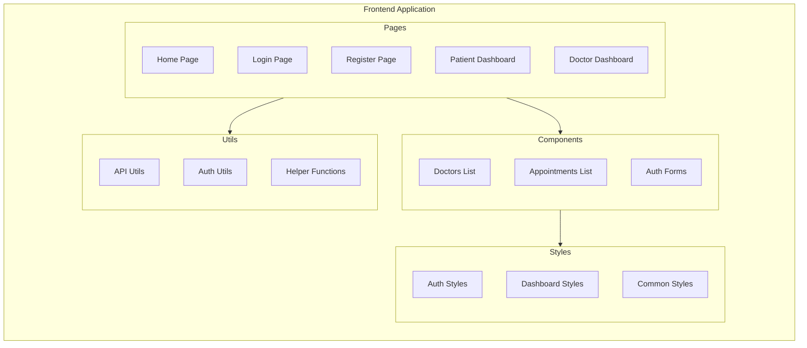
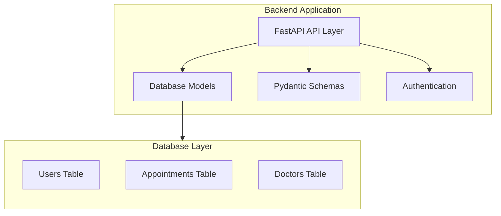
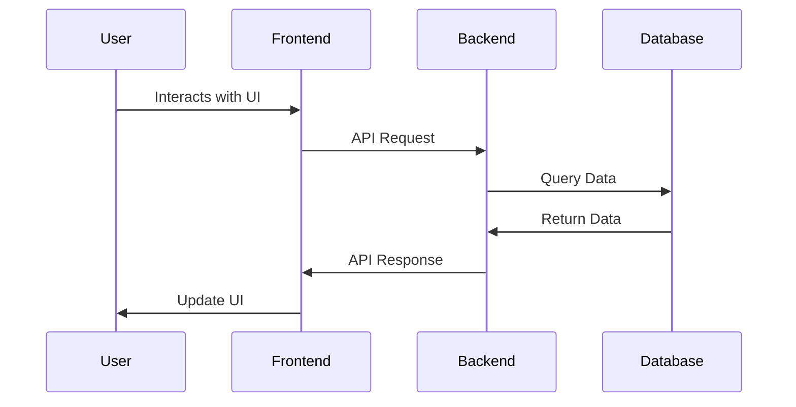
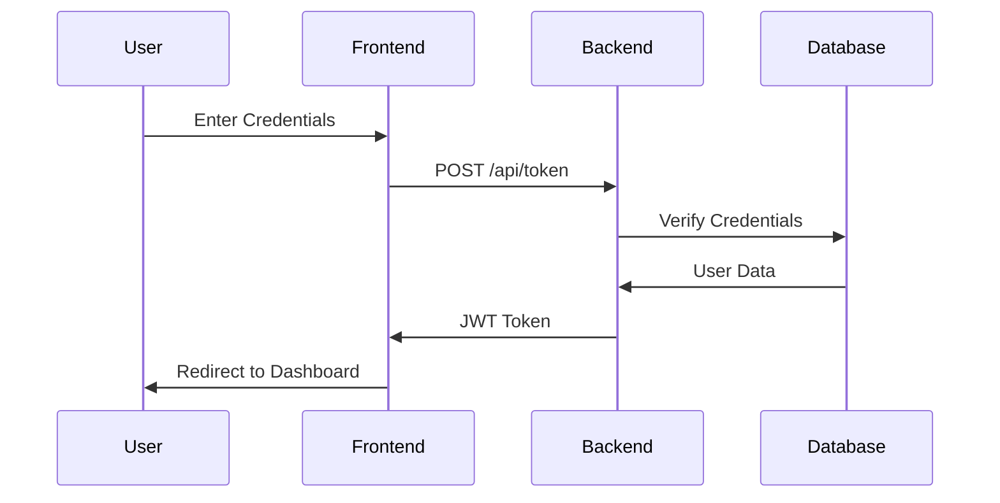
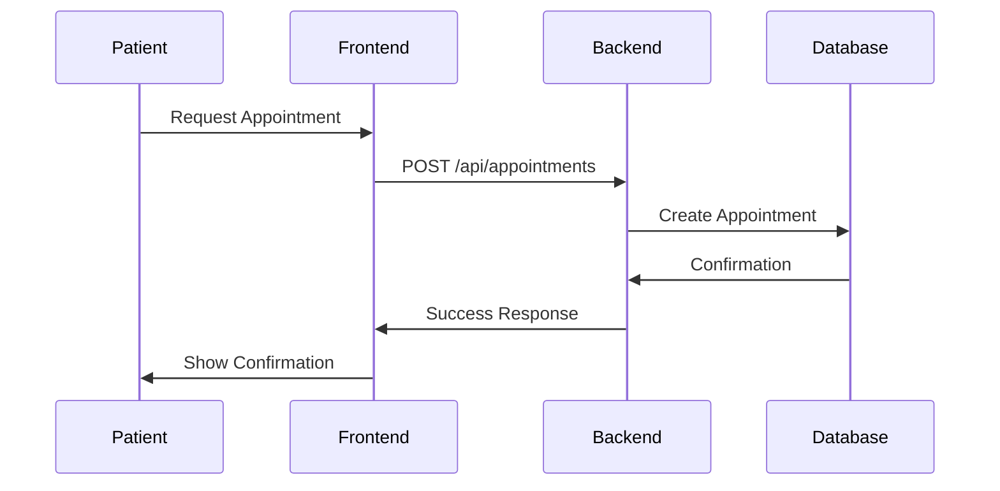
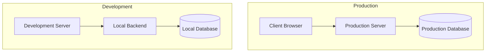

# Healthcare Appointment System Architecture

## System Overview

The Healthcare Appointment System is built using a modern web architecture with a clear separation between frontend and backend components. The system follows a client-server model with a RESTful API design.

## Component Architecture

### Frontend Architecture

### Backend Architecture

## Technology Stack

### Frontend
- **Framework**: React.js
- **Routing**: React Router
- **State Management**: React Hooks & Local Storage
- **Styling**: CSS Modules
- **Testing**: Jest & React Testing Library

### Backend
- **Framework**: FastAPI
- **Database**: SQLite
- **ORM**: SQLAlchemy
- **Authentication**: JWT (JSON Web Tokens)
- **Testing**: Pytest

## Data Flow

## Authentication Flow

## Appointment Management Flow

## Key Features and Components

### Authentication Flow
1. User registration/login
2. JWT token generation
3. Token-based authentication
4. Role-based access control (Doctor/Patient)

### Appointment Management
1. Appointment creation
2. Status updates
3. Cancellation handling
4. Appointment listing

### User Management
1. User registration
2. Profile management
3. Role-specific dashboards
4. Session handling

## Security Measures

1. **Authentication**
   - JWT-based authentication
   - Secure password hashing
   - Token expiration

2. **Authorization**
   - Role-based access control
   - Protected routes
   - API endpoint security

3. **Data Protection**
   - Input validation
   - SQL injection prevention
   - XSS protection

## Testing Strategy

1. **Frontend Testing**
   - Unit tests for components
   - Integration tests for pages
   - User interaction testing

2. **Backend Testing**
   - API endpoint testing
   - Database integration tests
   - Authentication tests

## Deployment Architecture

## Scalability Considerations

1. **Database**
   - Efficient indexing
   - Query optimization
   - Connection pooling

2. **API**
   - Rate limiting
   - Caching strategies
   - Load balancing ready

3. **Frontend**
   - Code splitting
   - Lazy loading
   - Asset optimization 