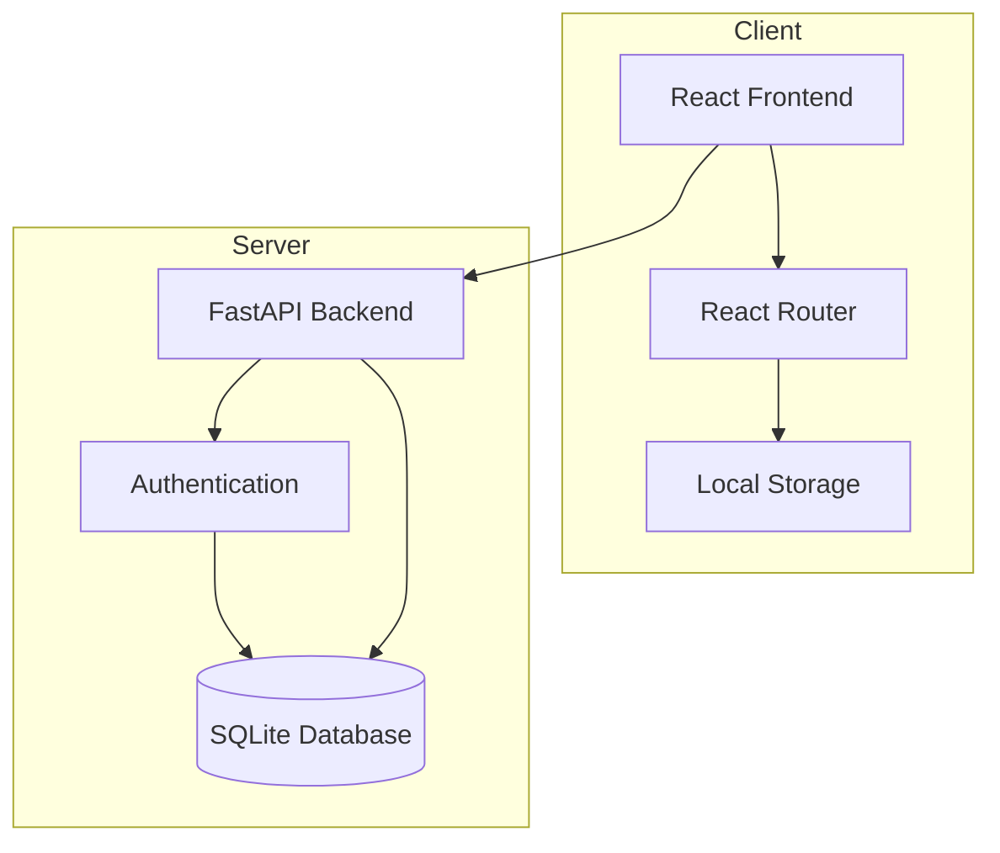
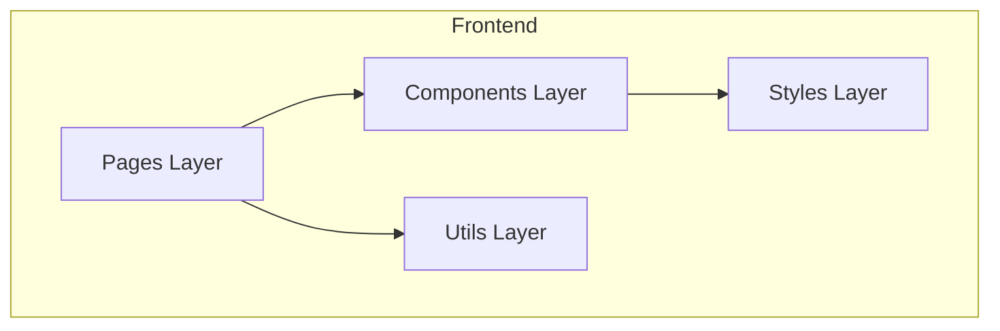
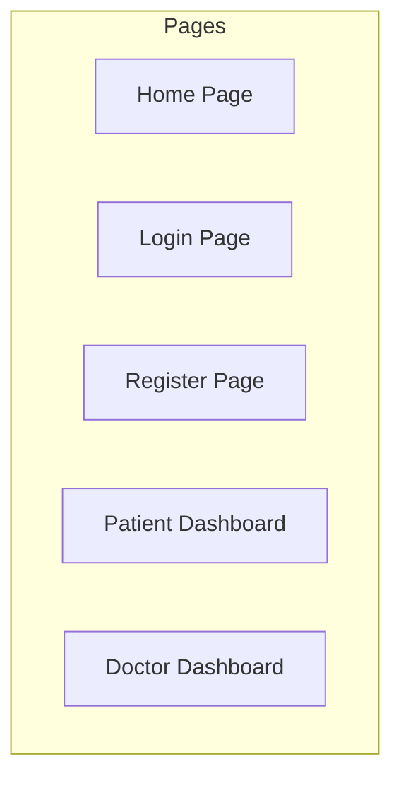
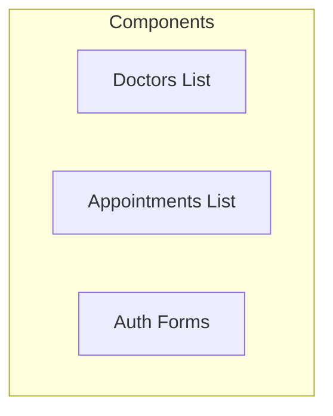
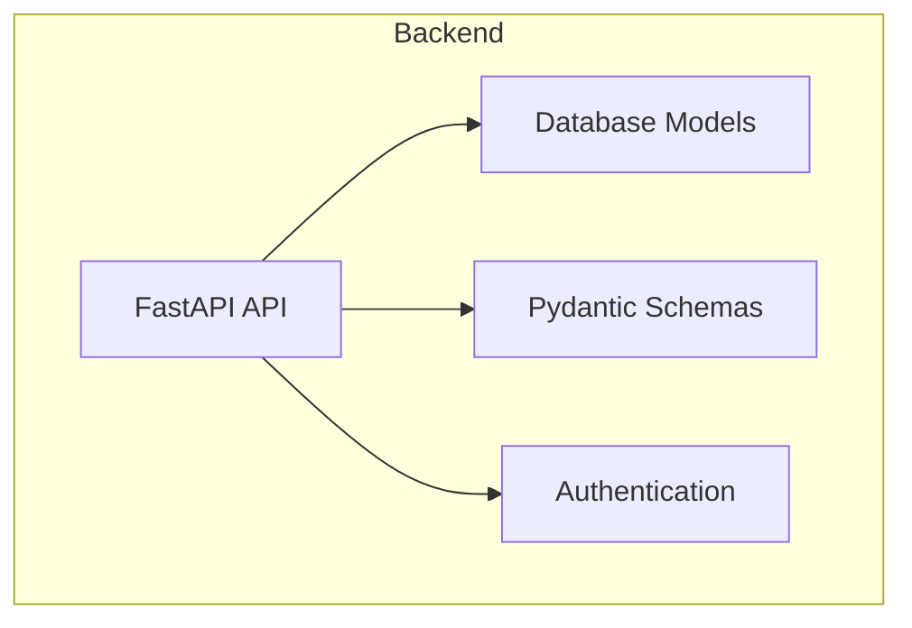
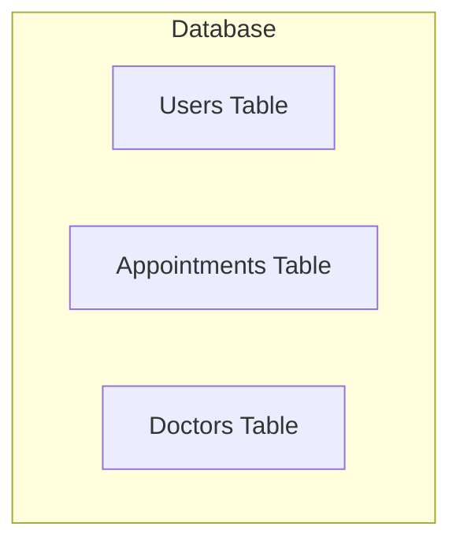
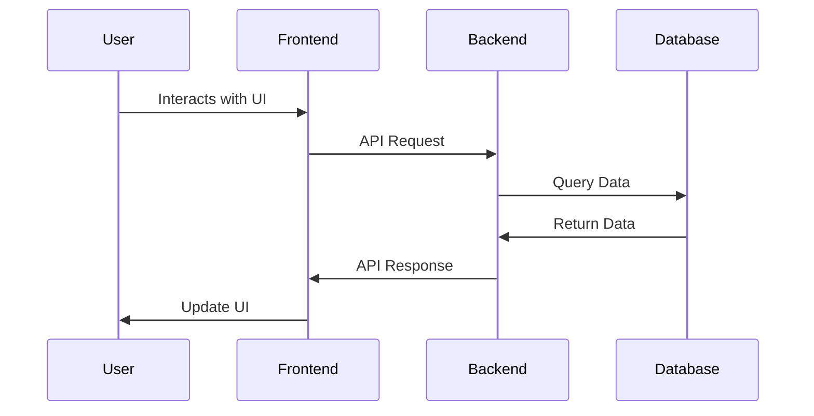
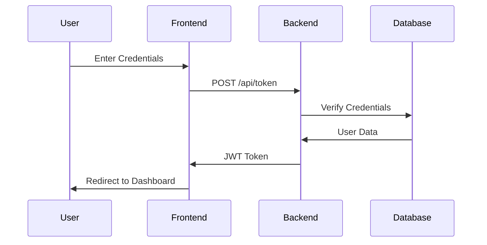
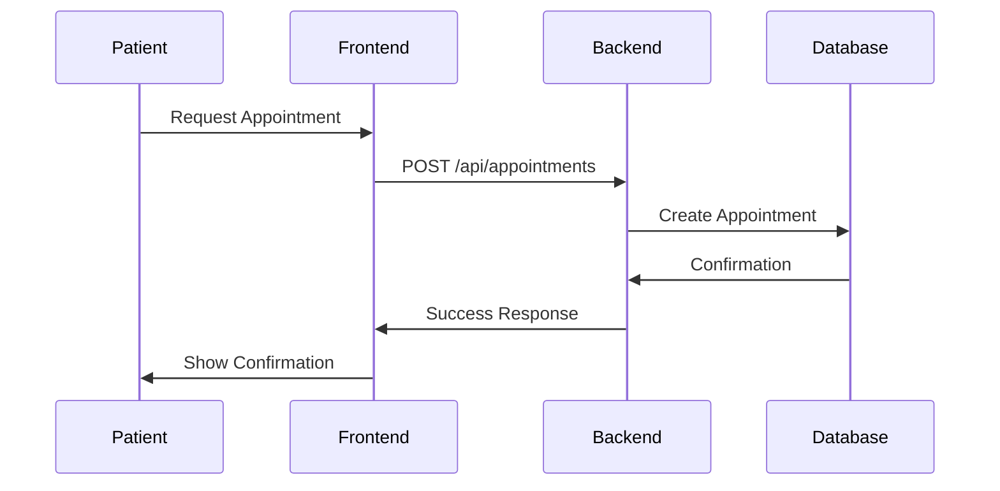
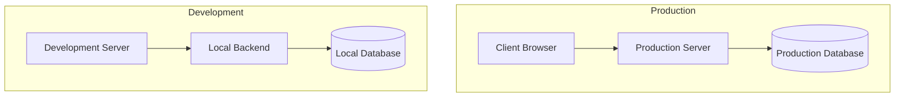

# Healthcare Appointment System - Architecture Diagrams

## 1. System Overview

## 2. Frontend Structure

## 3. Frontend Pages

## 4. Frontend Components

## 5. Backend Structure

## 6. Database Structure

## 7. Basic Data Flow

## 8. Authentication Flow

## 9. Appointment Creation Flow

## 10. Development vs Production
